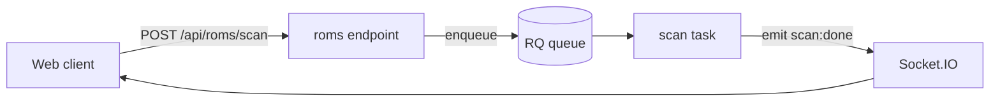

# RomM: Review Polish & Verification

Two passes, in order, once the change works:

1. **Polish (A–D):** shape the code the checks can't see. Derived from the
   corrections a maintainer actually pushed on top of 37 approved contributor
   PRs — every rule below is something that got hand-fixed after review, so
   applying it up front saves a round trip.
2. **Verify (E):** run the checks that match what you touched, mirroring the CI
   gates so review isn't the first place a failure shows up. Polish comes
   first, since it renames things, extracts helpers, and edits tests; `trunk
fmt && trunk check` comes last of all, so nothing lands unformatted. If
   polish changed behaviour rather than only shape, re-run the tests too.

---

## A. Comments and docstrings: the most-corrected thing in this repo

`CLAUDE.md` already says keep comments short, don't restate the code, don't
explain a change. In practice contributions still ship multi-paragraph
rationale, and it gets cut. Cut it yourself.

**Hard limits.** A comment is one or two lines. A docstring is one sentence plus
an `Args:`/`Returns:` block when the signature needs it. If you wrote three or
more lines of prose, you are explaining, not commenting.

**Delete outright:**

- **Change history and migration notes.** "Replaces the manual pattern: ...",
  "this was dropped in 06cafd4b1", "gating it on the ENABLE_SCHEDULED_* flags
  left those jobs queued". The comment describes what the code does now. Reasons
  for the change belong in the commit message and the PR body.
- **Restatements of the adjacent line.** A `withTotal?: boolean` field does not
  need `// Skip the result-set count server-side`. An index named
  `idx_roms_missing_from_fs` does not need `# Serves the Missing tab`.
- **Defences of an obvious choice.** "so oversized input is rejected by
  validation instead of by the database", "these are the identifiers a user
  already knows a platform by".
- **Comparisons to the alternative you didn't pick.** "VueUse's `useMounted` is
  not a substitute because ...", "not worth rewriting".
- **The product name as the actor.** Write "before unfetched media paths were
  cleared", not "before RomM cleared unfetched media paths".

**Keep** the one non-obvious fact a reader cannot recover from the code: a
provider's undocumented behaviour, a cross-file invariant, a deliberate
fail-safe. One line.

```python
# ScreenScraper answers a refused credential set with a 200 and this marker in
# the body, so the text is checked before the status.
LOGIN_ERROR_CHECK: Final = "Erreur de login"
```

**This applies to Markdown too.** Doc tables and architecture notes get trimmed
the same way. A `KIOSK_MODE` row reads `Read-only anonymous access`, not that
plus a parenthetical about what logged-in accounts keep.

**User-facing copy is not a comment, but it gets the same precision pass.**
"midnight French time" became "midnight CET".

---

## B. One home per value: no second copy

The second most-corrected pattern. Before you declare a constant, type, limit,
regex, or store getter, search for it. If it exists, import it.

- **Limits live on the model, endpoints import them.** A
  `PLAYLIST_NAME_MAX_LENGTH = 400` in `endpoints/` duplicating the column width
  is wrong; export it from `models/` and import. While there, check the sibling
  field actually has its `max_length` too.
- **A type declared in the component that owns it gets exported.** Don't
  re-declare `type Kind = "regular" | "smart"` in a second SFC. Export it from
  the owner and import it.
- **One list feeding two patterns.** The article list behind both the sort key
  and LaunchBox's inverted-title regex is a single `ARTICLES` tuple that both
  regexes are built from.
- **Don't add a store getter that differs from an existing one only by
  sorting.** Fix the existing one instead. A near-duplicate getter usually means
  the original sorts on the wrong field (`name` where the UI shows
  `display_name`).
- **A repeated inline branch becomes a named helper with its own unit test.**
  Pull the cover-url fallback or the page-total resolution out, then test the
  helper directly.

**Do not over-extract.** A literal used once, whose meaning is plain at the call
site, stays inline. Naming every string is its own kind of noise, and it gets
trimmed too.

---

## C. Names say what the thing does

- `syncRom` renamed to `syncCachedRom`: it updates the cache, it does not fetch.
- Sort on `display_name` when `display_name` is what the user sees.

If a reviewer has to open the body to learn what a function touches, the name is
short a word.

---

## D. Tests: strict typing is part of the test

Trunk runs mypy over `backend/tests/`, and `vue-tsc` covers frontend tests. Both
catch these, but only after the contributor has handed the PR over.

- **Narrow optionals before attribute access.** `mock.await_args` is
  `X | None`; bind it and `assert ... is not None` first.
- **Build fixtures with a typed factory,** not a bare object literal cast:
  `function rom(overrides: Partial<DetailedRom> = {}): DetailedRom`.
- **Fakes need real signatures.** Subclass the type the code actually receives
  (`io.BytesIO`, not `io.RawIOBase`) and annotate the override.
- **Vue component mocks use the object `props` form**, since ESLint's Vue rules
  reject the array shorthand:
  `props: { label: { type: String, default: "" } }`.
- **Test through the path production uses.** If the endpoint moved to
  `get_roms_scalar(smart_collection_id=...)`, the test calls that, not the
  internal handler the endpoint no longer touches.

---

## E. Verification before handoff

Run the checks that match what you touched. **Static checks don't prove a
feature works** — when UI changed, also test it in the browser. **Never
`--no-verify`.**

**Commit whatever `trunk fmt` rewrites.** A "run fmt" commit landing on top of a
PR is the single most common post-review fix in this repo. The recurring hits:
import order (Vitest before Vue, component before its sibling module), Prettier
joining a wrapped call or swapping quotes in a template string, ESLint's Vue
rules on test mocks (`vue/one-component-per-file`, array-shorthand `props`), and
mypy wanting explicit annotations on `__init__` attributes
(`self.search_url: str = ...`, `Final[float]`).

### Frontend (`frontend/`)

Run from `frontend/`:

1. `npm run typecheck`: zero errors (`vue-tsc --noEmit`).
2. `npm run typecheck:scripts`: zero errors (`tsc -p tsconfig.node.json`, covers `scripts/`).
3. `npm run lint` _(if present)_ / ESLint clean. Trunk also runs ESLint + Prettier in CI.
   If polish turned up a mechanical pattern (you fixed the same kind of thing
   twice), encode it instead of relying on the next reviewer: enable a stock
   rule in `eslint.config.js`, or add `frontend/eslint-plugin-romm/rules/<name>.js`
   plus `<name>.test.ts` (`RuleTester`, valid and invalid cases), register it in
   the plugin's `index.js`, and turn it on in `eslint.config.js`. Test with
   `npx vitest run eslint-plugin-romm` and `npm run typecheck:scripts`.
4. `npm run test`: zero failures (Vitest + happy-dom; runs unit tests **and** every `/lib` story's `play()` via `composeStories`).
5. `npm run build`: zero failures (CI sanity check).

**If you touched the backend API:** start the backend, run `npm run generate`, then re-`typecheck`.

**If you touched tokens** (`src/v2/tokens/index.ts`): `npm run build:tokens` (also auto-runs on `predev`/`prebuild`) and confirm `tokens.css` regenerated.

**If you touched locales** (`src/locales/**`): `python3 frontend/src/locales/check_i18n_locales.py` must pass with zero missing/extra keys. See the `frontend-i18n` skill.

#### UI manual pass (when changes are visible) — v2

With `uiVersion = "v2"`:

- **Golden path + edge cases:** empty, error, loading, no-permission, extreme data; plus nearby regressions.
- **Both themes:** `v2-dark` and `v2-light`.
- **All four input modalities:** mouse, touch, keyboard, gamepad — focus ring only on `key`/`pad`.
- **Responsive sweep:** 320px → 4K across the `useBreakpoint` tiers; overlays full-bleed on `xs`.
- **Accessibility:** contrast, keyboard reachability with no traps, aria-labels on icon-only controls.
- **Performance:** lists/grids of 1000+ items stay smooth; every `v-for` has a stable `:key`.
- **Screenshots:** capture the change while you're in there, at least one and enough to
  convey what's different. Shoot the component or view in its real surroundings, not a
  full-page dump, and save to a temp dir outside the repo.
  See [F. The PR description](#f-the-pr-description).

#### Storybook (for `/lib`)

- New primitive → mandatory story with controls + at least one variant per theme; interactive ones get a `play()`.
- Modified primitive → existing story still renders and interactions still pass.
- Don't duplicate coverage between Vitest (pure logic) and Storybook `play()` (components).
- Responsive composites: sweep the Storybook viewport presets (see `frontend-v2-input`).

### Backend (`backend/`)

Run from `backend/`:

1. `uv run pytest <path/file>` — zero failures on the tests affected by the diff. Never run the whole suite locally (20+ minutes); see [AGENTS.md](../../../AGENTS.md) for how to pick targets. CI runs it in full.
2. `trunk fmt && trunk check` — ruff/black/isort/mypy/bandit clean (CI enforces Trunk).
3. **If you added a migration:** `uv run alembic upgrade head` then `uv run alembic downgrade -1` to prove both directions; it must work on MariaDB **and** PostgreSQL (CI runs both).
4. **If a response schema or route signature changed:** regenerate frontend types (`npm run generate`) and typecheck the frontend.

### CI gates this mirrors

`typecheck.yml` (vue-tsc + lockfile lint), `frontend.yml` (vitest + build), `i18n.yml` (locale check), `pytest.yml` (pytest on MariaDB + PostgreSQL), `migrations.yml` (alembic on both DBs), `trunk-check.yml` (Trunk across the repo). Green locally → green in CI.

### Don't

- Open a PR without manually testing the UI when UI was touched.
- Open a PR on a UI change with an empty `Screenshots` section.
- Describe a boundary change in prose alone when a diagram would land it in one read.
- `--no-verify` on commits.
- Leave a locale key English-only, a token un-generated, or a migration one-directional.

---

## F. The PR description

Base it on `.github/PULL_REQUEST_TEMPLATE.md`, and carry the two things a reviewer cannot
reconstruct from the diff.

### Screenshots, for a UI change

The template's `Screenshots (if applicable)` heading is not optional for a UI change; a reviewer
who can't see the change reviews the diff instead of the result. Shoot enough to give that
reviewer the gist, and stop there: one shot carries most changes.

- **Before/after** when the change alters something that already existed and the after alone
  wouldn't read as different, labelled as such.
- **A second theme** only when the change is theme-dependent; a state or breakpoint only when it's
  the point of the change.
- Name the files for what they show (`missing-games-actions.png`); the filename is the alt text
  when you don't supply one.

Upload them yourself with `gh`, which takes `--attach '<file>#<alt text>'` (up to 50 per command)
on `pr create`, `pr edit` and `pr comment`. Write the body referencing each file by its local path
and `gh` rewrites the reference to the uploaded asset, so the shots land under the `Screenshots`
heading instead of being appended at the end:

```bash
# /tmp/pr-body.md, under the Screenshots heading:
#   
gh pr create --title '...' --body-file /tmp/pr-body.md \
  --attach /tmp/shots/missing-games-actions.png
```

On an existing PR, `gh pr edit --attach` keeps the current body and appends the upload unless the
body already references the file. A partial upload still creates or updates the PR and exits
non-zero, so check the body rather than trusting the exit code. Never commit the images or push
them to a branch to get a URL. Only fall back to handing the user file paths when the upload
fails.

### Mermaid diagram, for an architectural change

GitHub renders a fenced `mermaid` block in a PR body, so a change that moves a boundary gets one:
a new service, handler, or task in a request or job path; a model or relationship change; a new
external provider or integration; a different call path across layers; an auth, session, or socket
flow. Code that changes inside an existing boundary does not.

- **Draw what changed**, with the new pieces distinguishable from what was already there. A
  diagram that redraws the whole backend teaches nothing.
- **Pick the type for the question:** `flowchart` for a call or data path, `sequenceDiagram` for an
  exchange whose order over time is the point (auth handshake, scan lifecycle), `erDiagram` for
  models and their relationships.
- **Label the edges** with what crosses them, the call, the payload, the event name, not "uses".
- **No custom colors or styling.** The default theme is the one that reads in both of GitHub's.
- **Make sure it parses.** An unparseable block renders as raw text in the description. When the
  syntax isn't one you're sure of, render it first:
  `npx -y @mermaid-js/mermaid-cli -i d.mmd -o d.svg -p pc.json`, where `pc.json` is
  `{"executablePath": "<a local Chrome>", "args": ["--no-sandbox"]}` (puppeteer downloads no
  browser of its own here).



---

## Checklist

- [ ] No comment or docstring over two lines of prose; no change history, no
      restatement, no justification of the obvious
- [ ] Every new constant, type, limit, and getter searched for first
- [ ] Names say what the code touches
- [ ] Tests typecheck strictly and exercise the production path
- [ ] Stack checks in E green for everything touched (typecheck/test/build,
      pytest, migrations both directions, OpenAPI regen)
- [ ] UI changes tested in the browser: both themes, all four input modalities,
      responsive sweep
- [ ] UI changes screenshotted (enough to convey the change), and the shots
      uploaded to the PR with `gh ... --attach`
- [ ] Architectural changes carry a `mermaid` diagram in the PR description
- [ ] `trunk fmt && trunk check` clean, with whatever fmt rewrote committed
