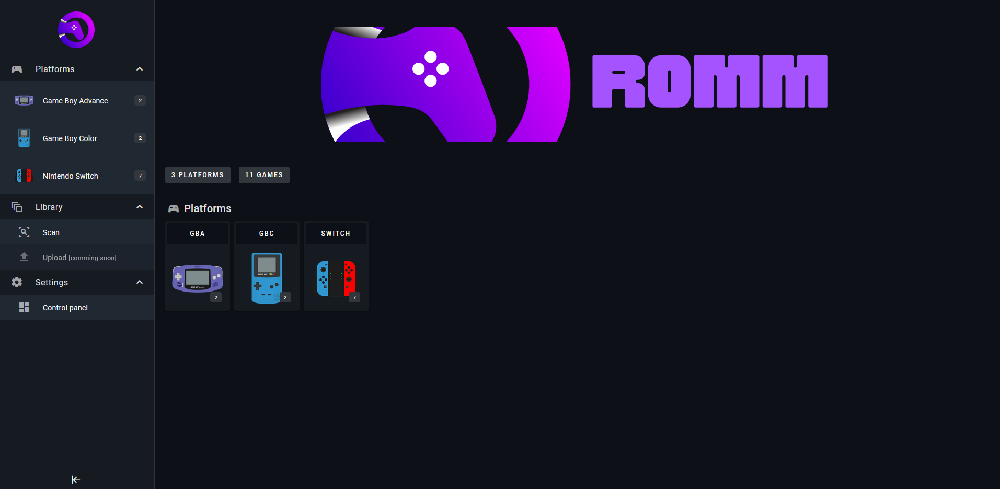
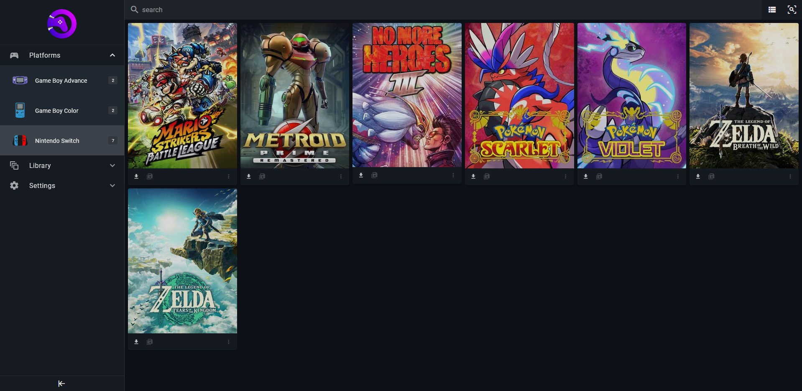
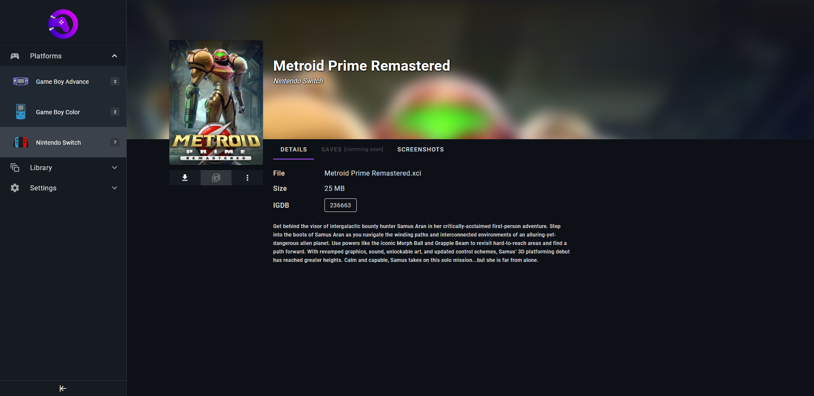
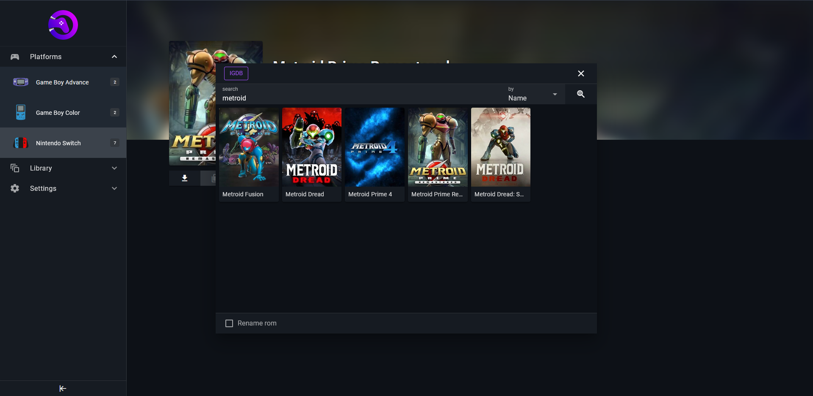
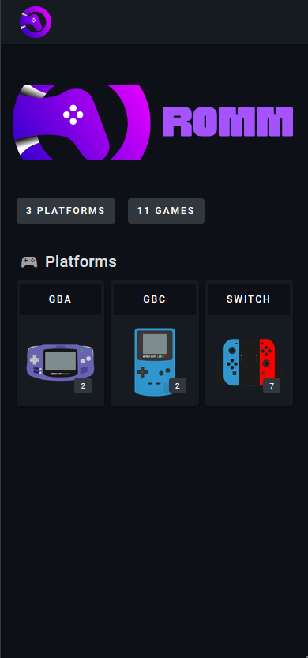
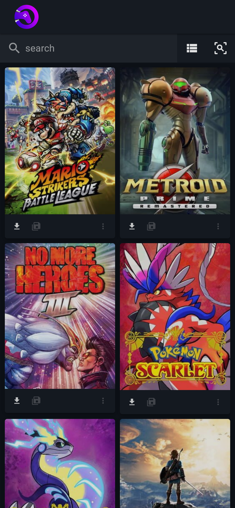
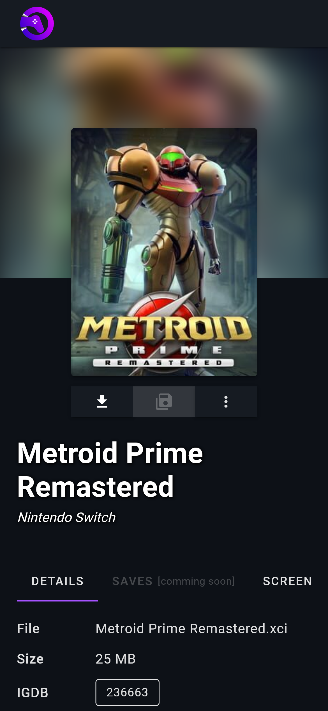

<div align="center">
  <h1 style="padding:20px;"></h1>
  
  
  
<br>
  <a href="https://hub.docker.com/r/zurdi15/romm">
  
  
  <a href="https://discord.gg/P5HtHnhUDH">
  
</div>
<br>
<div align="center">
  <a href="https://www.buymeacoff.ee/zurdi15" target="_blank"></a>
</div>

# Overview

RomM (stands for Rom Manager) is a game library manager focused in retro gaming. Manage and organize all of your games from a web browser.

Inspired by [Jellyfin](https://jellyfin.org/), allows you to manage all your games from a modern interface while enriching them with IGDB metadata.

## ⚡ Features

* Scan your game library (all at once or by platform) and enriches it with IGDB metadata
* Access your library via your web-browser
* Possibility to select one of the matching IGDB results if the scan doesn't get the right one
* EmuDeck folder structure compatibility
* Multiple files games support
* Download games directly from your web-browser
* Edit your game files directly from your web-browser
* Region, revision/version and extra tags support
* Works with SQLite or MaridDB (SQLite by default)
* Responsive design
* Light and dark theme

## 🛠 Roadmap

* Upload games directly from your web-browser - [issue #54](https://github.com/zurdi15/romm/issues/54)
* Manage save files directly from your web-browser - [issue #55](https://github.com/zurdi15/romm/issues/55)
* Set a custom cover for each game - [issue #53](https://github.com/zurdi15/romm/issues/53)

# Preview

## 🖥 Desktop
<br>
<details>
  <summary>Expand to preview</summary>

  
  
  
  

</details>
<br>

## 📱 Mobile
<br>
<details>
  <summary>Expand to preview</summary>

  
  
  
  

</details>
<br>

# The RomM community
[Wiki](https://github.com/zurdi15/romm/wiki) <br/>
[Discord](https://discord.gg/P5HtHnhUDH)<br/>

# Installation

## 🐳 Docker

Docker should be installed and set up before running the [image](https://hub.docker.com/r/zurdi15/romm/tags).

1. Generate an API key for [IGDB](https://www.igdb.com/), and set the `IGDB_CLIENT_ID` and `IGDB_CLIENT_SECRET` variables. _This is required to run a library scan._ Instructions on generating the ID and Secret are [here](https://api-docs.igdb.com/#about). Note that IDGB requires a Twitch account with 2FA enabled to generate the ID and Secret.
2. Verify that your library folder structure matches one of the options listed in the [following section](#folder-structure).
3. Create a docker-compose file. See the following example [docker-compose.yml](https://github.com/zurdi15/romm/blob/master/examples/docker-compose.example.yml) file for reference. Customize for your setup and include the `IGDB_CLIENT_ID` and `IGDB_CLIENT_SECRET` vareiables where indicated in the  environment section of the file.
4. Launch the container:
  
  ```bash
  docker-compose up -d
  ```

 If configured correctly, Romm will automatically run an initial scan on your library.
  
  
# Configuration

  <h2 id="folder-structure">📁 Folder structure</h2>

RomM accepts two different folder structure by priority. RomM will try to find the structure 1 and if it doesn't exists, RomM will try to find structure 2.

Review the [Platforms support](#platform-support) section for device naming conventions, and the [Configuration file](#configuration-file) section to override default system names in the folder structure, if your directories are named differently.

  - Structure 1 (high priority) - roms folder at root of library folder:
  ```
  library/
  ├─ roms/
     ├─ gbc/
     │  ├─ rom_1.gbc
     │  ├─ rom_2.gbc
     │
     ├─ gba/
     │  ├─ rom_1.gba
     │  ├─ rom_2.gba
     │ 
     ├─ ps/
        ├─ my_multifile_game/
        │   ├─ my_game_cd1.iso
        │   ├─ my_game_cd2.iso
        │
        ├─ rom_1.iso
  ```
  - Structure 2 (low priority) - roms folder inside each platform folder
  ```
  library/
  ├─ gbc/
  │  ├─ roms/
  │     ├─ rom_1.gbc
  │     ├─ rom_2.gbc
  |
  ├─ gba/
  │  ├─ roms/
  │     ├─ rom_1.gba
  │     ├─ rom_2.gba
  |
  ├─ ps/
  │  ├─ roms/
  │     ├─ my_multifile_game/
  │     │  ├─ my_game_cd1.iso
  │     │  ├─ my_game_cd2.iso
  │     │
  │     ├─ rom_1.iso
  ```

<h2 id="configuration-file">⚙️ Configuration file</h2>

RomM can be configured through a yml file.

For a configuration change to take effect, RomM must be restarted.

Check the [config.yml](https://github.com/zurdi15/romm/blob/master/examples/config.example.yml) example.

Check the [docker-compose.yml](https://github.com/zurdi15/romm/blob/master/examples/docker-compose.example.yml) example to see how to bind it.

# Naming convention 

  <h2 id="platform-support">🎮 Platform support</h2>

If the RomM [folder structure](#📁-folder-structure) is followed, any kind of platform/folder-name is supported for the core features. For having extra metadata as well as cover images and platforms icons, the following table shows how to name your platforms folders.
This will change over the time, adding games metadata for more platforms.

<br>
<details>
  <summary>Platform support list</summary>
  <span>

| slug                    | name                                | games metadata |
|-------------------------|-------------------------------------|     :----:     |
| 3ds                     | Nintendo 3DS                        | ✅             |
| amiga                   | Amiga                               | ✅             |
| acpc                    | Amstrad CPC                         | ✅             |
| arcade                  | Arcade                              | ✅             |
| atari                   | atari                               | ❌             |
| atari2600               | Atari 2600                          | ✅             |
| atari5200               | Atari 5200                          | ✅             |
| atari7800               | Atari 7800                          | ✅             |
| coleco                  | coleco                              | ❌             |
| c64                     | Commodore C64/128/MAX               | ✅             |
| cpc                     | cpc                                 | ❌             |
| cps1                    | cps1                                | ❌             |
| cps2                    | cps2                                | ❌             |
| cps3                    | cps3                                | ❌             |
| daphne                  | daphne                              | ❌             |
| dc                      | Dreamcast                           | ✅             |
| doom                    | doom                                | ❌             |
| dos                     | DOS                                 | ✅             |
| fairchild               | fairchild                           | ❌             |
| fba2012                 | fba2012                             | ❌             |
| fbneo                   | fbneo                               | ❌             |
| fds                     | Family Computer Disk System         | ✅             |
| game-and-watch          | Game & Watch                        | ✅             |
| gb                      | Game Boy                            | ✅             |
| gba                     | Game Boy Advance                    | ✅             |
| gbc                     | Game Boy Color                      | ✅             |
| genesis-slash-megadrive | Sega Mega Drive/Genesis             | ✅             |
| gamegear                | Sega Game Gear                      | ✅             |
| gw                      | gw                                  | ❌             |
| intellivision           | Intellivision                       | ✅             |
| jaguar                  | Atari Jaguar                        | ✅             |
| lynx                    | Atari Lynx                          | ✅             |
| md                      | md                                  | ❌             |
| megaduck                | megaduck                            | ❌             |
| ms                      | ms                                  | ❌             |
| msx                     | MSX                                 | ✅             |
| n64                     | Nintendo 64                         | ✅             |
| nds                     | Nintendo DS                         | ✅             |
| neocd                   | neocd                               | ❌             |
| neogeo                  | neogeo                              | ❌             |
| nes                     | Nintendo Entertainment System       | ✅             |
| ngc                     | Nintendo GameCube                   | ✅             |
| ngp                     | ngp                                 | ❌             |
| odyssey                 | odyssey                             | ❌             |
| pc-98                   | PC-98                               | ✅             |
| pce                     | pce                                 | ❌             |
| pcecd                   | pcecd                               | ❌             |
| pico                    | pico                                | ❌             |
| pokemon-mini            | Pokémon mini                        | ✅             |
| ps                      | PlayStation                         | ✅             |
| ps2                     | PlayStation 2                       | ✅             |
| ps3                     | PlayStation 3                       | ✅             |
| ps4                     | ps4                                 | ❌             |
| psp                     | PlayStation Portable                | ✅             |
| psvita                  | PlayStation Vita                    | ✅             |
| saturn                  | Sega Saturn                         | ✅             |
| sega32                  | Sega 32X                            | ✅             |
| scummvm                 | scummvm                             | ❌             |
| segacd                  | Sega CD                             | ✅             |
| segasgone               | segasgone                           | ❌             |
| sms                     | Sega Master System/Mark III         | ✅             |
| sgb                     | sgb                                 | ❌             |
| sgfx                    | sgfx                                | ❌             |
| snes                    | Super Nintendo Entertainment System | ✅             |
| supervision             | supervision                         | ❌             |
| switch                  | Nintendo Switch                     | ✅             |
| virtualboy              | Virtual Boy                         | ✅             |
| wii                     | Wii                                 | ✅             |
| win                     | PC (Microsoft Windows)              | ✅             |
| wiiu                    | Wii U                               | ✅             |
| wonderswan              | WonderSwan                          | ✅             |
| wonderswan-color        | WonderSwan Color                    | ✅             |
| xbox                    | Xbox                                | ✅             |
| xbox360                 | Xbox 360                            | ✅             |
| xboxone                 | Xbox One                            | ✅             |

  </span>
</details>
<br>

## 📑 Tags support

Games can be tagged with region, revision or other tags using parenthesis in the file name. 

 - Regions will be detected according to the following dictionary:

| shortcode | region        |
|-----------|---------------|
| A         | Australia     |
| AS        | Asia          |
| B         | Brazil        |
| C         | Canada        |
| CH        | China         |
| E         | Europe        |
| F         | France        |
| FN        | Finland       |
| G         | Germany       |
| GR        | Greece        |
| H         | Holland       |
| HK        | Hong Kong     |
| I         | Italy         |
| J         | Japan         |
| K         | Korea         |
| NL        | Netherlands   |
| NO        | Norway        |
| PD        | Public Domain |
| R         | Russia        |
| S         | Spain         |
| SW        | Sweden        |
| T         | Taiwan        |
| U         | USA           |
| UK        | England       |
| UNK       | Unknown       |
| UNL       | Unlicensed    |
| W         | World         |

*Aditionally, region can be set adding **"reg-"** as prefix: (reg-E) / (reg-Spain) / (reg-USA)

 - Revision tags must be prefixed with **"rev "** or with **"rev-"**: (rev v1) / (rev-v1) / (rev-whatever)

  - Any other tag can have any structure

  - Example: **my_game (E)(rev v1)(fav)(aditional_tag).gba**

**NOTE:** Tags can be used with the search bar to help to filter your library.

# ⛏ Troubleshoot

* After the first installation, sometimes the RomM container can have problems connecting with the database. Restarting the RomM container may solve the problem.

# 🧾 References

* Complete [changelog](https://github.com/zurdi15/romm/blob/master/CHANGELOG.md)

# 🎖 Credits

* PC icon support - <a href="https://www.flaticon.com/free-icons/keyboard-and-mouse" title="Keyboard and mouse icons">Keyboard and mouse icons created by Flat Icons - Flaticon</a>
* Default user icon - <a target="_blank" href="https://icons8.com/icon/tZuAOUGm9AuS/user-default">User Default</a> icon by <a target="_blank" href="https://icons8.com">Icons8</a>
