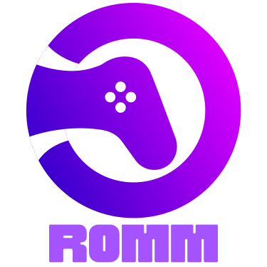

  

  <h3 style="font-size: 25px;">
    A beautiful, powerful, self-hosted rom manager.
  </h3>
   

[![license-badge]][license-badge-url]
[![release-badge]][release-badge-url]
[![docker-pulls-badge]][docker-pulls-badge-url]

[![discord-badge]][discord-badge-url]
[![unraid-badge]][unraid-badge-url]
[![wiki-badge]][wiki-url]

  

> [!WARNING]
> Version 3.0 introduces exciting new fetures that require some changes to how RomM is setup and configured. **If you're currently running a 2.x version, please review the [migration guide](https://github.com/rommapp/romm/wiki/Upgrading-to-3.0) before upgrading.**

# Overview

RomM (ROM Manager) allows you to scan, enrich, and browse your game collection with a clean and responsive interface. With support for multiple platforms, various naming schemes and custom tags, RomM is a must-have for anyone who plays on emulators.

## Features

- Scans your existing games library and enchances it with metadata from [IGDB][igdb-api] and [MobyGames][mobygames-api]
- Supports a large number of **[platforms][platform-support]**
- Play games directly from the browser using [EmulatorJS][wiki-emulatorjs-url]
- Share your library with friend while [limiting access and permissions][authentication]
- Supports MAME, Nintendo Switch, and Sony Playstation naming schemes
- Detects and groups **multifile games** (e.g. PS1 games with multiple CDs)
- Can [parse tags][tag-support] in filenames (e.g. (E), (USA), (rev v1), etc.)
- View, upload, update, and delete games from any modern web browser

## Preview

|                              🖥 Desktop                              |                                                  📱 Mobile                                                   |
| :-----------------------------------------------------------------: | :----------------------------------------------------------------------------------------------------------: |
|  |  |

# Installation

Before running the [image][docker-tags], ensure that Docker is installed and running on your system.

1. [Generate API keys][wiki-generate-api-keys] for IGDB and/or MobyGames to fetch metadata.
2. Verify that your library folder structure matches one of the options listed in the [folder structure][folder-structure] section.
3. Create a docker-compose.yml file by referring to the example [docker-compose.yml][docker-compose-example] file for guidance, and customize it for your setup with [the available environment variables][wiki-env-variables].
4. Launch the container(s) with `docker-compose up -d`.

> [!NOTE]
> **If you are having issues with RomM, please review the [wiki page][wiki-troubleshooting-url] for troubleshooting steps and common issues.**

# Configuration

## Folder Structure

As mentioned in the installation section, RomM requires a specific folder structure to work. The two supported structures are as follows:

<table border="0">
 <tr>
    <th style="text-align: center"><b>Structure A (recommended)</b></tthd>
    <th style="text-align: center"><b>Structure B (fallback)</b></th>
 </tr>
 <tr>
  <td>
    <code>library/roms/gbc/rom_1.gbc</code>
  </td>
  <td>
    <code>library/gbc/roms/rom_1.gbc</code>
  </td>
 </tr>
 <tr>
    <td>
      <pre>
        library/
        ├─ roms/
        │  ├─ gbc/
        │  │  ├─ rom_1.gbc
        │  │  ├─ rom_2.gbc
        │  │
        │  ├─ gba/
        │  │  ├─ rom_1.gba
        │  │  ├─ rom_2.gba
        │  │
        │  ├─ ps/
        │     ├─ my_multifile_game/
        │     │   ├─ my_game_cd1.iso
        │     │   ├─ my_game_cd2.iso
        │     │
        │     ├─ rom_1.iso
        ├─ bios/
        │  ├─ gba/
        │  │  ├─ gba_bios.bin
        │  │
        │  ├─ ps/
        │     ├─ scph1001.bin
        |     ├─ scph5501.bin
        |     ├─ scph5502.bin
      </pre>
    </td>
    <td>
      <pre>
        library/
        ├─ gbc/
        │  ├─ roms/
        │     ├─ rom_1.gbc
        │     ├─ rom_2.gbc
        │
        ├─ gba/
        │  ├─ roms/
        │     ├─ rom_1.gba
        │     ├─ rom_2.gba
        |  ├─ bios/
        |     ├─ gba_bios.bin
        │
        ├─ ps/
        │  ├─ roms/
        │     ├─ my_multifile_game/
        │     │  ├─ my_game_cd1.iso
        │     │  ├─ my_game_cd2.iso
        │     │
        │     ├─ rom_1.iso
        |  ├─ bios/
        |     ├─ scph1001.bin
        |     ├─ scph5501.bin
        |     ├─ scph5502.bin
      </pre>
    </td>
 </tr>
</table>

> [!TIP]
> For folder naming conventions, review the [Platform Support][platform-support] section. To override default system names in the folder structure (if your directories are named differently), see the [Configuration File][configuration-file] section.

## Configuration File

RomM's "understanding" of your library can be configured with a `config.yaml` file or through the `config` tab in the `Control Panel` under `Settings` section. Refer to the [example config.yml][configuration-file-example] file for guidance on how to configure it, and the [example docker-compose.yml][docker-compose-example] file on how to mount it into the container.

## Scheduler

The scheduler allows you to scheduled async tasks that run in the Redis container at regular intervals. Jobs can be run at a specific time in the future, after a time delta, or at recurring internals using cron notation. The [wiki page on the scheduler][wiki-scheduled-tasks] has more information on how which tasks are available and how to enable them.

# Naming Convention

## Platform Support

If you adhere to the [RomM folder structure][folder-structure], RomM supports all platforms listed on the [Supported Platforms][wiki-supported-platforms-url] page. **The folder is is case sensitive and must be used exactly how it appears in the list.** When scanning your library, RomM will use the folder name to determine the platform and fetch the appropriate game information, metadata, and cover art.

Additionally, some of these platforms have custom icons available ([learn more about platform icons in our wiki][wiki-platforms-icons-url]).

## Tag Support

Games can be tagged with region, revision, or other tags by using parentheses in the file name. Additionally, you can set the region and language by adding a prefix: (USA), [reg-J], (French), [De].

- Revision tags must be prefixed with **"rev "** or **"rev-"** (e.g. **(rev v1)** or **(rev-1)**)
- Other tags will also be imported, for example: **my_game [1.0001]\(HACK\)[!].gba**

Tags can be used to search for games in the search bar. For example, searching for **(USA)** will return all games with the USA tag.

# Community

Here are a few projects maintained by members of our community. As they are not regularly reviewed by the RomM team, **we recommend you closely review them before use**.

- CasaOS app via the [BigBear App Store][big-bear-casaos]
- [Helm Chart to deploy on Kubernetes][kubernetes-helm-chart] by @psych0d0g

Join us on discord, where you can ask questions, submit ideas, get help, showcase your collection, and discuss RomM with other users.

[![discord-invite]][discord-invite-url]

## Support

If you like this project, consider buying me a coffee!

[![coffee-donate]][coffee-donate-url]

## Our Friends

Here are a few projects that we think you might like:

- [EmulatorJS](https://emulatorjs.org/): An embeddable, browser-based emulator
- [RetroDECK](https://retrodeck.net/): Retro gaming on SteamOS and Linux
- [ES-DE Frontend](https://es-de.org/): Emulator frontend for Linux, macOS and Windows
- [Gaseous](https://github.com/gaseous-project/gaseous-server): Another self-hosted ROM manager

<!-- Sections -->

[folder-structure]: #-folder-structure
[platform-support]: #-platform-support
[authentication]: #-authentication
[tag-support]: #-tag-support
[configuration-file]: #-configuration-file

<!-- Files -->

[docker-compose-example]: examples/docker-compose.example.yml
[configuration-file-example]: examples/config.example.yml

<!-- Wiki links -->

[wiki-url]: https://github.com/rommapp/romm/wiki
[wiki-supported-platforms-url]: https://github.com/rommapp/romm/wiki/Supported-Platforms
[wiki-authentication-url]: https://github.com/rommapp/romm/wiki/Authentication
[wiki-platforms-icons-url]: https://github.com/rommapp/romm/wiki/Custom-Platform-Icons
[wiki-troubleshooting-url]: https://github.com/rommapp/romm/wiki/Troubleshooting
[wiki-emulatorjs-url]: https://github.com/rommapp/romm/wiki/EmulatorJS-Player
[wiki-env-variables]: https://github.com/rommapp/romm/wiki/Environment-Variables
[wiki-scheduled-tasks]: https://github.com/rommapp/romm/wiki/Scheduled-Tasks
[wiki-generate-api-keys]: https://github.com/rommapp/romm/wiki/Generate-API-Keys

<!-- Badges -->

[license-badge]: https://img.shields.io/github/license/rommapp/romm?style=for-the-badge&color=a32d2a
[license-badge-url]: LICENSE
[release-badge]: https://img.shields.io/github/v/release/rommapp/romm?style=for-the-badge
[release-badge-url]: https://github.com/rommapp/romm/releases
[discord-badge]: https://img.shields.io/badge/discord-7289da?style=for-the-badge
[discord-badge-url]: https://discord.gg/P5HtHnhUDH
[unraid-badge]: https://img.shields.io/badge/Unraid-f57842?style=for-the-badge&labelColor=ee512b
[unraid-badge-url]: https://forums.unraid.net/topic/149738-support-eurotimmy-romm-rom-manager-by-zurdi15/
[wiki-badge]: https://img.shields.io/badge/Wiki-736e9b?style=for-the-badge
[docker-pulls-badge]: https://img.shields.io/docker/pulls/rommapp/romm?style=for-the-badge&label=pulls
[docker-pulls-badge-url]: https://hub.docker.com/r/rommapp/romm

<!-- Links -->

[discord-invite]: https://invidget.switchblade.xyz/P5HtHnhUDH
[discord-invite-url]: https://discord.gg/P5HtHnhUDH
[coffee-donate]: https://www.buymeacoffee.com/assets/img/custom_images/orange_img.png
[coffee-donate-url]: https://www.buymeacoff.ee/zurdi15

<!-- External links -->

[docker-tags]: https://hub.docker.com/r/rommapp/romm/tags
[igdb-api]: https://api-docs.igdb.com/#account-creation
[mobygames-api]: https://www.mobygames.com/info/api/
[titleid-program-id-url]: https://switchbrew.org/w/index.php?title=Title_list/Games&mobileaction=toggle_view_desktop
[igdb-platforms-list]: https://www.igdb.com/platforms
[big-bear-casaos]: https://github.com/bigbeartechworld/big-bear-casaos
[kubernetes-helm-chart]: https://artifacthub.io/packages/helm/crystalnet/romm
[pc-mac-icons]: https://www.flaticon.com/free-icons/keyboard-and-mouse
[flaticon]: https://www.flaticon.com
[user-default-icon]: https://icons8.com/icon/tZuAOUGm9AuS/user-default
[icons8]: https://icons8.com
