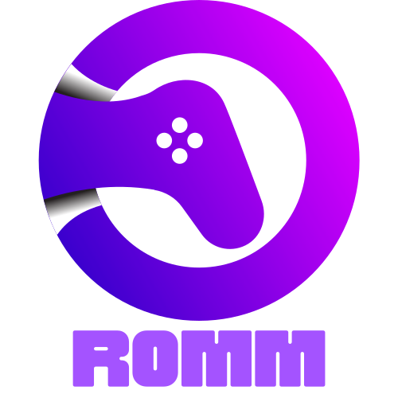
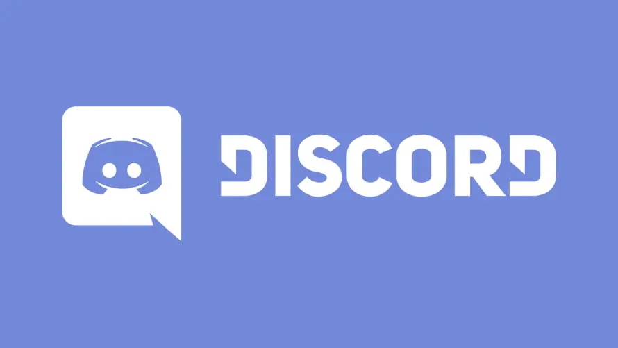

<div align="center">
  <h1></h1>
  
  
  
</div>
<div align="center">
  <a href="https://hub.docker.com/r/zurdi15/romm">
    
  </a>
  <a href="https://hub.docker.com/r/zurdi15/romm">
    
  </a>
  <a href="https://discord.gg/P5HtHnhUDH">
    
  </a>
</div>

<br>

<div align="center">
  <a href="https://www.buymeacoff.ee/zurdi15" target="_blank">
    
  </a>
</div>

# Overview

RomM (**ROM M**anager) is a game library manager focused on retro gaming. It enables you to efficiently manage and organize all your games from a web browser.

Inspired by [Jellyfin](https://jellyfin.org/), RomM allows you to handle all your games through a modern interface while enhancing them with IGDB metadata.

## ⚡ Features

- Scan your game library (all at once or by platform) and enrich it with IGDB metadata.
- Access your library via your web browser.
- Easily choose from matching IGDB results if the scan doesn't find the right one.
- Compatible with EmuDeck folder structures.
- Supports games with multiple files.
- Download games directly from your web browser.
- Edit your game files directly from your web browser.
- Upload games directly from your web-browser
- Set a custom cover for each game
- Includes region, revision/version, and extra tags support.
- Works with SQLite or MaridDB.
- Features a responsive design with dark mode support.

# Preview

## 🖥 Desktop


## 📱 Mobile


# The RomM Community

<a href="https://discord.gg/P5HtHnhUDH"></a>
<a href="https://github.com/zurdi15/romm/wiki"></a>

# Installation

## 🐳 Docker

Before running the [image](https://hub.docker.com/r/zurdi15/romm/tags), ensure that Docker is installed and set up.

1. Generate an API key for [IGDB](https://www.igdb.com/) and set the `IGDB_CLIENT_ID` and `IGDB_CLIENT_SECRET` variables. This step is essential for running a library scan. Instructions for generating the ID and Secret can be found [here](https://api-docs.igdb.com/#about). Note that IGDB requires a Twitch account with 2FA enabled to generate the ID and Secret.
2. Verify that your library folder structure matches one of the options listed in the [folder structure](#-folder-structure) section.
3. Create a docker-compose file. Refer to the example [docker-compose.yml](examples/docker-compose.example.yml) file for guidance. Customize it for your setup and include the `IGDB_CLIENT_ID` and `IGDB_CLIENT_SECRET` variables in the environment section of the file.
4. Launch the container:

```bash
docker-compose up -d
```

# Configuration

## 📁 Folder Structure

RomM accepts two different folder structures by priority. RomM will attempt to find structure 1, and if it doesn't exist, it will look for structure 2.

For device naming conventions, review the [Platforms Support](#-platform-support) section. To override default system names in the folder structure (if your directories are named differently), see the [Configuration File](#%EF%B8%8F-configuration-file) section.

### Structure A (high-priority)

Example: `library/roms/gbc/game.zip`

```
library/
├─ roms/
│  ├─ gbc/
│  │  ├─ rom_1.gbc
│  │  ├─ rom_2.gbc
│  │
│  ├─ gba/
│  │  ├─ rom_1.gba
│  │  ├─ rom_2.gba
│  │
│  ├─ ps/
│     ├─ my_multifile_game/
│     │   ├─ my_game_cd1.iso
│     │   ├─ my_game_cd2.iso
│     │
│     ├─ rom_1.iso
```

### Structure B (low-priority)

Example: `library/gbc/roms/game.zip`

```
library/
├─ gbc/
│  ├─ roms/
│     ├─ rom_1.gbc
│     ├─ rom_2.gbc
│
├─ gba/
│  ├─ roms/
│     ├─ rom_1.gba
│     ├─ rom_2.gba
│
├─ ps/
│  ├─ roms/
│     ├─ my_multifile_game/
│     │  ├─ my_game_cd1.iso
│     │  ├─ my_game_cd2.iso
│     │
│     ├─ rom_1.iso
```

## ⚙️ Configuration File

RomM can be configured through a YAML file. To apply configuration changes, you must restart RomM.

Refer to the [config.example.yml](examples/config.example.yml) file and the [docker-compose.example.yml](examples/docker-compose.example.yml) for guidance on how to configure it.

## 🔒 Authentication

If you want to enable the user management system, a redis container and some environment variables needs to be set. Complete instructions are available in the [wiki](https://github.com/zurdi15/romm/wiki/Authentication).

## 📅 Scheduler

The scheduler allows to scheduled async tasks that run in the Redis container at regular intervals. Jobs can be run at a specific time in the future, after a time delta, or at recurring internals using cron notation.

Jobs can be toggled using these environment variables:

```
ENABLE_SCHEDULED_RESCAN: Whether to rescan on a schedule
SCHEDULED_RESCAN_CRON: Cron expression for scheduled rescan
ENABLE_SCHEDULED_UPDATE_SWITCH_TITLEDB: Whether to update the switch title database on a schedule
SCHEDULED_UPDATE_SWITCH_TITLEDB_CRON: Cron expression for scheduled switch title database update
ENABLE_SCHEDULED_UPDATE_MAME_XML: Whether to update the MAME XML on a schedule
SCHEDULED_UPDATE_MAME_XML_CRON: Cron expression for scheduled MAME XML update
```

### Scheduled rescan

Users can opt to enable scheduled rescans, and set the interval using cron notation. Not that the scan will **not completely rescan** every file, only catch those which have been added/updated.

### Switch titleDB update

Support was added for Nintendo Switch ROMs with filenames using the [titleid/programid format](https://switchbrew.org/w/index.php?title=Title_list/Games&mobileaction=toggle_view_desktop) (e.g. 0100000000010000.xci). If a file under the `switch` folder matches the regex, the scanner will use the index to attempt to match it to a game. If a match is found, the IGDB handler will use the matched name as the search term.

The associated task updates the `/fixtures/switch_titledb.json` file at a regular interval to support new game releases.

### MAME XML update

Support was also added for MAME arcade games with shortcode names (e.g. `actionhw.zip` -> ACTION HOLLYWOOD), and works in the same way as the titleid matcher (without the regex).

The associated task updates the `/fixtures/mame.xml` file at a regular interval to support updates to the library.

## 🔍 Watchdog

A watchdog was added which monitors the filesystem for events (files created/moved/deleted) and schedules a rescan of the platform (or entire library is a new platform was added).

Jobs can be toggled using these environment variables:

```
ENABLE_RESCAN_ON_FILESYSTEM_CHANGE: Whether to rescan when the filesystem changes
RESCAN_ON_FILESYSTEM_CHANGE_DELAY: Delay in minutes before rescanning on filesystem change
```

The watcher will monitor the `/library/roms` folder for changes to the filesystem, such as files being added, moved or deleted. It will ignore certain events (like modifying the file content or metadata), and will skip default OS files (like `.DS_Store` on mac).

When a change is detected, a scan will be scheduled for sometime in the future (default 5 minutes). If other events are triggered between now and the time at which the scan starts, more platforms will be added to the scan list (or the scan may switch to a full scan). This is done to reduce the number of tasks scheduled when many big changes happen to the library (mass upload, new mount, etc.)

# Naming Convention

## 🎮 Platform Support

If you adhere to the [RomM folder structure](#-folder-structure), RomM supports any platform listed in the [IGDB platforms list](https://www.igdb.com/platforms). RomM will retrieve game information, metadata, and covers for platforms in that list. Additionally, some of these platforms have custom icons available ([learn more about platform icons in our wiki](https://github.com/zurdi15/romm/wiki/Custom-Platform-Icons)).

## 📑 Tag Support

Games can be tagged with region, revision, or other tags by using parentheses in the file name.

\*Additionally, you can set the region by adding **"reg-"** as a prefix: (reg-E) / (reg-Spain) / (reg-USA)

- Revision tags must be prefixed with **"rev "** or **"rev-"**: (rev v1) / (rev-v1) / (rev-whatever)
- Other tags will also be imported, for example: **my_game (E)(rev v1)(fav)(additional_tag).gba**

**NOTE:** You can use these tags with the search bar to filter your library effectively.

# 🎖 Credits

- Pc and Mac icon support - <a href="https://www.flaticon.com/free-icons/keyboard-and-mouse" title="Keyboard and mouse icons">Keyboard and mouse icons created by Flat Icons - Flaticon</a>
- Default user icon - <a target="_blank" href="https://icons8.com/icon/tZuAOUGm9AuS/user-default">User Default</a> icon by <a target="_blank" href="https://icons8.com">Icons8</a>
