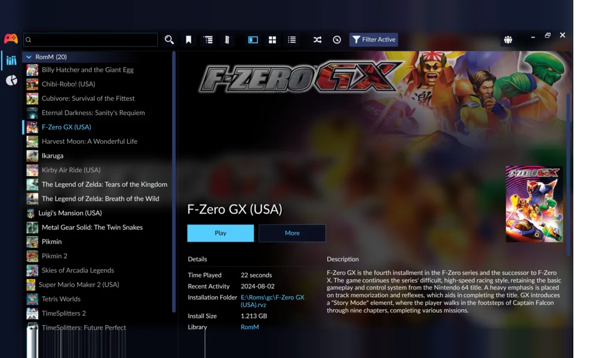
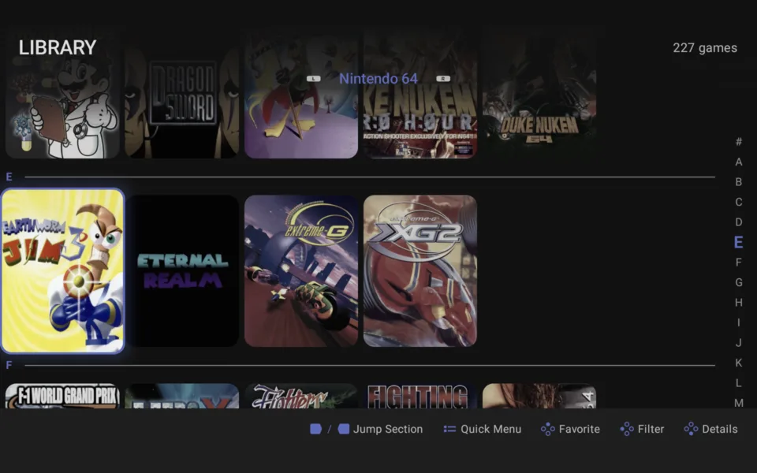
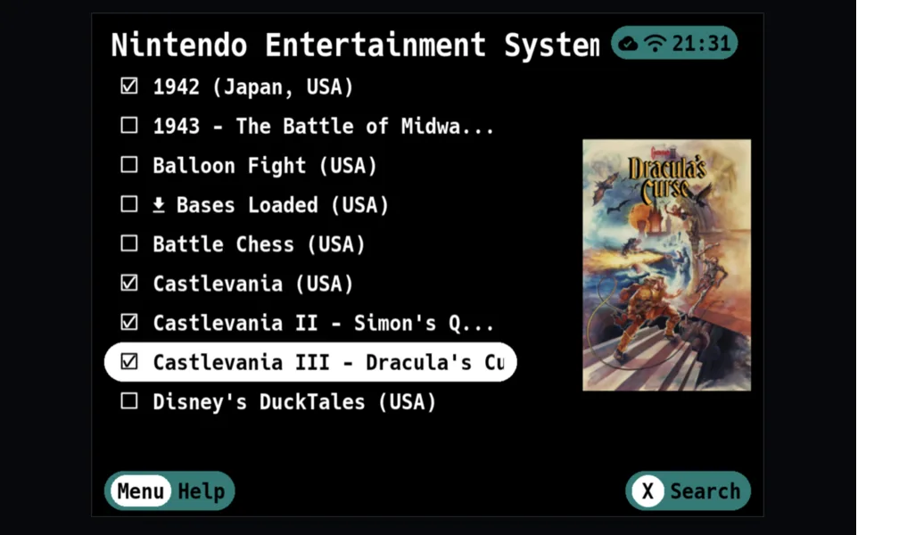

<!-- trunk-ignore-all(markdownlint/MD033) -->
<!-- trunk-ignore(markdownlint/MD041) -->

  

  <h3 style="font-size: 25px;">
    A beautiful, powerful, self-hosted ROM manager and player.
  </h3>

  

    
    
     
    
    
  

# Overview

Scan, enrich, browse and play your ROM collection from one beautiful & free self-hosted app. Metadata from 10+ providers, save sync across your devices, and support for over 400 platforms. RomM is a must-have for anyone who plays on emulators.

## Features

- Play in your browser with [EmulatorJS][docs-emulatorjs] and [RuffleRS][docs-rufflers], no setup required
- Keep [saves and states][docs-saves] in sync across your devices, with conflict resolution
- Scan and enrich your library with metadata from [IGDB][igdb-api], [Screenscraper][screenscraper-api], [LaunchBox][launchbox-api] and [MobyGames][mobygames-api]
- Fetch custom artwork from [SteamGridDB][steamgriddb-api] and track your achievements from [Retroachievements][retroachievements-api]
- Metadata available for [400+ platforms][docs-supported-platforms], plus multi-disk games, DLCs, mods, hacks and manuals
- Apply romhacks and translations on the fly with the built-in [ROM patcher][docs-rom-patcher]
- Share your library with granular [per-user permissions][docs-users-and-roles] and [OIDC single sign-on][docs-oidc]
- Official apps for [Playnite][playnite-app], [Android][argosy-launcher] and [CFWs][grout], plus [ES-DE and Pegasus exports][docs-exports] and a full [REST API][docs-api]
- Parse and filter by [tags][docs-tag-support] in filenames
- Free forever: AGPL-3.0, no tracking, no paid features, and total control of your data

## Preview

|                                       🖥 Desktop                                        |                                                           📱 Mobile                                                            |
| :------------------------------------------------------------------------------------: | :----------------------------------------------------------------------------------------------------------------------------: |
|  |  |

## Installation

The easiest way to start is with the [Quick Start Guide][docs-quick-start-guide] in the docs. If you're having trouble with setup, please review the page for [troubleshooting steps][docs-troubleshooting].

Prefer a hosted deploy over wiring up the stack yourself? Hostinger has a 1-click installer and host.

  
   Starting at <b>$6.49/mo</b> · <a href="https://docs.romm.app/latest/install/hostinger/">Setup guide</a>

<i>Deployment and infrastructure support for this install is handled by Hostinger. Prices are indicative and may not reflect current offerings. Signups through the link above send a share of the revenue back to us, which helps fund the project.</i>

## Official apps

###  Playnite plugin

Effortlessly integrate your retro game collection into [Playnite](https://playnite.link/), the open-source game library manager that provides a unified interface for all of your games on PC.

`Windows` `Desktop` `QR pairing`

&nbsp;&nbsp;by <a href="https://github.com/gantoine">@gantoine</a>

 

###  Argosy

Sync your library, download games on demand and track your achievements, from a gamepad-first interface designed for Anbernic, Retroid Pocket, Odin, and similar devices.

`Android` `Handhelds` `QR pairing` `Save sync`

&nbsp;&nbsp;by <a href="https://github.com/tmgast">@tmgast</a>

 

###  Grout

A lightweight client for your favorite handheld custom firmwares*. Download games, box art and BIOS files wirelessly, and sync your saves automatically as you play.

`Linux` `Handhelds` `Save sync`

&nbsp;&nbsp;by <a href="https://github.com/BrandonKowalski">@BrandonKowalski</a>

<i>*Supports Allium, Batocera, Knulli, MinUI, muOS, NextUI, Onion, ROCKNIX, Spruce and TrimUI.</i>

## Community

Here are some cool projects maintained by members of our community. Please note that our team does not regularly review their source code.

### Mobile

- [romm-ios-app][romm-ios-app]: Native iOS app by [@ilyas-hallak](https://github.com/ilyas-hallak)

### Desktop

- [RetroArch Sync][romm-retroarch-sync]: Sync RetroArch library with RomM by [@Covin90](https://github.com/Covin90)
- [RomMate][rommate]: Desktop app for browsing your collection by [@brenoprata10](https://github.com/brenoprata10)
- [romm-client][romm-client]: Desktop client by [@chaun14](https://github.com/chaun14)
- [Freegosy][freegosy]: All-in-one game manager by [@abduznik](https://github.com/abduznik)

### Handhelds

- [DeckyRommSync][decky-romm-sync]: SteamOS downloader and syncer by [@danielcopper](https://github.com/danielcopper)
- [SwitchRomM][switch-romm]: Homebrew NRO for Switch by [@Shalasere](https://github.com/Shalasere)

### Other

- [romm-comm][romm-comm-discord-bot]: Discord bot by [@idio-sync](https://github.com/idio-sync)
- [GGRequestz][ggrequestz]: Game discovery and request tool by [@XTREEMMAK](https://github.com/XTREEMMAK)
- [Syncthing sync][syncthing-sync]: Small tool to push a Syncthing library to RomM by [@amn-96](https://github.com/amn-96)

## Support the project

Consider supporting this project on Open Collective. Funds cover hosting, development, and maintenance, and we pass some along to community projects to nurture a healthy ecosystem of apps.

  

    
  

## Our Friends

Here are a few projects that we think you might like:

- [Lutris](https://lutris.net/): Open gaming platform for Linux
- [Cocoon](https://cocoon-shell.com/): Controller-first Android frontend for retro handhelds
- [muOS](https://muos.dev/): Custom firmware for Anbernic and other handhelds
- [RetroDECK](https://retrodeck.net/): Retro gaming on SteamOS and Linux
- [Steam ROM Manager](https://steamgriddb.github.io/steam-rom-manager/): An app for managing ROMs in Steam
- [Hasheous](https://hasheous.org/): Hash lookup service that maps ROMs to game metadata
- [Gaseous](https://github.com/gaseous-project/gaseous-server): Another ROM manager with web-based emulator
- [Playmatch](https://github.com/RetroRealm/playmatch): Microservice for matching ROM hashes to games
- [EmulatorJS](https://emulatorjs.org/): An embeddable, browser-based emulator
- [PortMaster](https://portmaster.games/): Native game ports for Linux handhelds
- [MelonLoader](https://melonloader.co/): Universal mod loader for Unity games
- [NextUI](https://nextui.loveretro.games/): MinUI-based custom firmware for TrimUI handhelds
- [RetroAchievements](https://retroachievements.org/): Achievements for retro games

## Supported By

These companies support us by providing their tools for free:

  

    
    
  

<!-- docs links -->

[docs-quick-start-guide]: https://docs.romm.app/latest/Getting-Started/Quick-Start-Guide/
[docs-supported-platforms]: https://docs.romm.app/latest/Platforms-and-Players/Supported-Platforms/
[docs-emulatorjs]: https://docs.romm.app/latest/Platforms-and-Players/EmulatorJS-Player/
[docs-rufflers]: https://docs.romm.app/latest/Platforms-and-Players/RuffleRS-Player/
[docs-troubleshooting]: https://docs.romm.app/latest/Troubleshooting/Scanning-Issues/
[docs-tag-support]: https://docs.romm.app/latest/Getting-Started/Folder-Structure/#tag-support
[docs-saves]: https://docs.romm.app/latest/using/saves-and-states/
[docs-rom-patcher]: https://docs.romm.app/latest/using/rom-patcher/
[docs-users-and-roles]: https://docs.romm.app/latest/administration/users-and-roles/
[docs-oidc]: https://docs.romm.app/latest/administration/oidc/
[docs-exports]: https://docs.romm.app/latest/reference/exports/
[docs-api]: https://docs.romm.app/latest/developers/api-reference/

<!-- External links -->

[igdb-api]: https://docs.romm.app/latest/Getting-Started/Metadata-Providers/#igdb
[screenscraper-api]: https://docs.romm.app/latest/Getting-Started/Metadata-Providers/#screenscraper
[mobygames-api]: https://docs.romm.app/latest/Getting-Started/Metadata-Providers/#mobygames
[launchbox-api]: https://docs.romm.app/latest/getting-started/metadata-providers/#launchbox
[steamgriddb-api]: https://docs.romm.app/latest/Getting-Started/Metadata-Providers/#steamgriddb
[retroachievements-api]: https://docs.romm.app/latest/Getting-Started/Metadata-Providers/#retroachievements
[romm-comm-discord-bot]: https://github.com/idio-sync/romm-comm
[decky-romm-sync]: https://github.com/danielcopper/decky-romm-sync
[switch-romm]: https://github.com/Shalasere/SwitchRomM
[playnite-app]: https://github.com/rommapp/playnite-plugin
[ggrequestz]: https://github.com/XTREEMMAK/ggrequestz
[syncthing-sync]: https://github.com/amn-96/romm_syncthing_sync
[romm-client]: https://github.com/chaun14/romm-client
[romm-retroarch-sync]: https://github.com/Covin90/romm-retroarch-sync
[rommate]: https://github.com/brenoprata10/rommate
[freegosy]: https://github.com/abduznik/freegosy
[grout]: https://github.com/rommapp/grout
[romm-ios-app]: https://github.com/ilyas-hallak/romm-ios-app
[argosy-launcher]: https://github.com/rommapp/argosy-launcher
