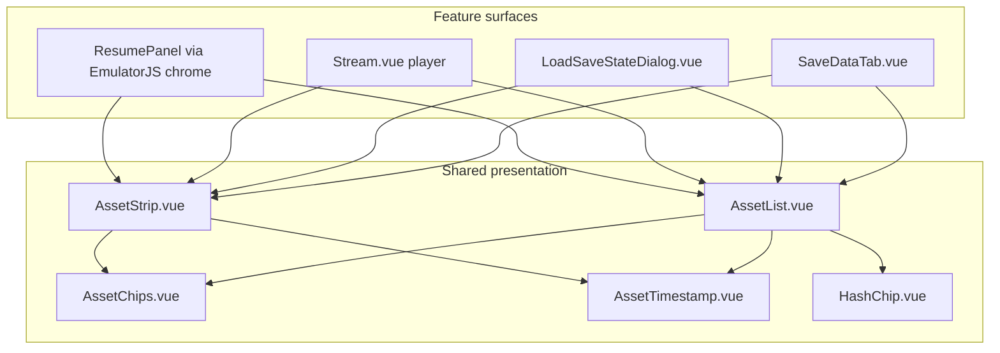

# Phase 1: Expose save/state information already in the API (frontend only)

Implementation plan for [GitHub #4320](https://github.com/rommapp/romm/issues/4320) (closed as spec; work not fully landed in v2 Save data tab).  
Parent triage: [save-and-metadata-related-issues.md](./save-and-metadata-related-issues.md).

**Scope:** v2 UI only. **No** OpenAPI changes, migrations, or new fields.  
**Goal:** Make saves and states readable in the Save data tab, launch pickers, and Storybook without asking users to rename files or open devtools.

**Table key:** ✅ OK or skip · 🔧 phase 1 work · ⏸️ needs backend / later phase

---

## Data already on the wire

These fields are on generated types today (`frontend/src/__generated__/models/`):

|     | Field                         | Save / State schema   | Used in v2 lists today?                        | Phase 1                                              |
| --- | ----------------------------- | --------------------- | ---------------------------------------------- | ---------------------------------------------------- |
| 🔧  | `file_name`                   | both                  | yes (often ellipsised)                         | tooltips in manage mode                              |
| 🔧  | `emulator`                    | both                  | saves: chips; states: group title or chips     | state rows in Save data tab                          |
| ✅  | `slot`                        | saves only            | slot grouping in `AssetList`                   | —                                                    |
| 🔧  | `updated_at` / `created_at`   | both                  | full on save rows; easy to miss on state tiles | states → `AssetList`                                 |
| ✅  | `file_size_bytes`             | both                  | `AssetChips`                                   | —                                                    |
| ✅  | `screenshot`                  | both                  | row/tile thumbnail                             | —                                                    |
| 🔧  | `content_hash`                | saves only (optional) | not rendered                                   | `HashChip` on save rows                              |
| ✅  | `username` / public           | `User*Schema`         | `AssetOwnerChip`                               | —                                                    |
| ⏸️  | state `content_hash`          | —                     | N/A                                            | [#4418](https://github.com/rommapp/romm/issues/4418) |
| ⏸️  | state `slot` / `disc_file_id` | —                     | N/A                                            | [#4419](https://github.com/rommapp/romm/issues/4419) |
| ⏸️  | device sync fields            | saves                 | N/A                                            | [#4420](https://github.com/rommapp/romm/issues/4420) |

---

## Problem summary (#4320)

1. **Save data tab, States subtab** uses `AssetStrip` (`layout="flow"`, `group-by="emulator"`) while **Saves** uses `AssetList`. State tiles show less metadata than save rows (especially when grouped: no per-tile emulator chip; timestamp easy to miss on narrow tiles).
2. **Manage mode** (`selectable=false`): `RTooltip` is gated on `v-if="selectable"` in both `AssetList` and `AssetStrip`, so truncated filenames have **no** hover/focus path to the full name in the Save data tab.
3. **`content_hash`** on saves is never shown (Metadata/Files tabs already use `HashChip` for ROM hashes).
4. **Identical-looking state tiles**: browser-player filenames share a ROM prefix; the distinguishing timestamp sits at the **end** of `file_name`, where ellipsis clips it.

Reference (v1 parity): `frontend/src/components/common/Game/AssetCard.vue` showed emulator chip, size, relative + exact `Updated:` for the same objects.

---

## Component map

|     | Component               | Path                                          | Storybook               | Phase 1                          |
| --- | ----------------------- | --------------------------------------------- | ----------------------- | -------------------------------- |
| 🔧  | **AssetList**           | `shared/AssetList.vue`                        | ✅ `Shared/AssetList`   | tooltips, hash, stories, tests   |
| 🔧  | **AssetStrip**          | `shared/AssetStrip.vue`                       | ✅ `Shared/AssetStrip`  | manage tooltips, stories, tests  |
| ✅  | **AssetChips**          | `shared/AssetChips.vue`                       | none                    | optional story only              |
| ✅  | **AssetTimestamp**      | `shared/AssetTimestamp.vue`                   | none                    | —                                |
| 🔧  | **HashChip**            | `shared/HashChip.vue`                         | none                    | wire into `AssetList`            |
| 🔧  | **SaveDataTab**         | `GameDetails/SaveDataTab.vue`                 | none                    | states → `AssetList` + new story |
| ✅  | **LoadSaveStateDialog** | `Player/LoadSaveStateDialog.vue`              | none                    | inherits list changes            |
| ✅  | **ResumePanel**         | `ResumePanel.stories.ts` + `AssetPreview.vue` | ✅ `Player/ResumePanel` | fixture refresh optional         |

---

## Implementation tasks (by component)

### 1. `AssetList.vue`

**Changes**

- **Tooltips in manage mode:** Show `RTooltip` (or equivalent accessible `title` + focusable wrapper) when `selectable === false`. Same payload as today: full `file_name` + exact timestamp (`formatTimestamp` + `timeLabel` / `AssetTimestamp` date source).
- **`type="state"` parity:** Ensure state rows use the same chip + timestamp column as saves (already wired; verify with state fixtures). Widen screenshot cell for states if needed (reuse `--shot` 64px or bump to match #4320 row screenshot).
- **Save `content_hash`:** When `type === 'save'` and `'content_hash' in asset && asset.content_hash`, render `HashChip` (label e.g. `MD5` or reuse Files tab convention) in the chips row next to `AssetChips`. Import from `@/v2/components/shared/HashChip.vue`.

**Call sites:** no prop changes required; Save data tab will pass states through `AssetList` after task 4.

**Tests:** extend `AssetList.test.ts` for manage-mode tooltip presence and hash chip when `content_hash` set.

---

### 2. `AssetStrip.vue`

**Changes**

- **Tooltips in manage mode:** Same fix as `AssetList` (`v-if="selectable"` → allow manage mode, or split “show detail tooltip” prop defaulting true).
- **Strip / flow layouts:** Confirm `AssetTimestamp` and `AssetChips` remain visible on small tiles; adjust CSS if exact time is hidden (today `AssetTimestamp` hides exact on `xs` only).

**Call sites:** Keep **Stream** and **LoadSaveStateDialog** on `AssetStrip` for horizontal/history UX where appropriate. Save data tab may stop using strip after migration to `AssetList`.

**Tests:** `AssetStrip.test.ts` — manage mode tooltip; optional regression for `layout="list"`.

---

### 3. `AssetChips.vue` (optional small tweak)

**Changes**

- None required for phase 1 unless hash moves here instead of `AssetList` (prefer **`AssetList` only** for hash to avoid strip duplication).
- Consider `showHash` prop later if both list and strip must show hash; phase 1 targets save **rows** only.

**Storybook:** add `AssetChips.stories.ts` with emulator / latest / size variants (quick visual for chip tones).

---

### 4. `SaveDataTab.vue` (product-visible switch)

**Changes**

- **States subtab (Mine + Community):** Replace `AssetStrip` with **`AssetList`**:
  - `type="state"`
  - `:selectable="false"`
  - `:scrollable="false"`
  - Keep `#actions` → `AssetActions` unchanged.
  - Drop `layout="flow"` and `group-by="emulator"` **or** keep grouping via a future `AssetList` group-by emulator (not in API today as a separate concern; states can stay flat list sorted by `updated_at`, emulator chip on each row via `AssetChips`).
- Optional: sort states `byUpdatedDesc` before pass-through (if not already guaranteed by API).

**Why:** #4320 item 5 — one row component, full width for filename, 16:9 thumb in row leading cell, emulator + exact time visible without opening each tile.

---

### 5. `LoadSaveStateDialog.vue` / `Stream.vue`

**Changes**

- **Minimal for phase 1:** selectable mode already has tooltips. Verify save rows show `content_hash` after `AssetList` change.
- **Stream / player:** state picker can stay `AssetStrip` (`layout="flow"`, `group-by="emulator"`) for scanability; document in Storybook that Save data tab is the “dense management” layout and player is the “pick to launch” layout.

---

### 6. Shared fixtures (recommended for Storybook)

Extract mock builders from `AssetList.stories.ts` / `AssetStrip.stories.ts` into something like:

`frontend/src/v2/utils/saveStateStoryFixtures.ts`

Include:

- Saves with slots + datetime-tagged filenames (realistic RomM upload names).
- Saves with/without `content_hash`.
- States with **identical prefix**, different timestamp tails (regression for ellipsis).
- States with/without `emulator`, with/without screenshot.

Both story files import fixtures so Save data and player stories stay in sync.

---

## Storybook plan (storybookify for visual QA)

Run: `npm run storybook` → sidebar paths below.

### Expand existing

|     | Story file              | Add stories                                                                                              |
| --- | ----------------------- | -------------------------------------------------------------------------------------------------------- |
| 🔧  | `AssetList.stories.ts`  | **States · manage**, **Save · content hash**, **Manage · tooltip** (long shared prefix / timestamp tail) |
| 🔧  | `AssetStrip.stories.ts` | **Manage mode** + **tooltip** after code fix; keep **Long filenames**                                    |

### Add new

|     | Story file                       | Sidebar title                | Purpose                                                  |
| --- | -------------------------------- | ---------------------------- | -------------------------------------------------------- |
| 🔧  | `SaveDataTab.stories.ts`         | `GameDetails/SaveDataTab`    | Full Save data tab mock (mine + community, both subtabs) |
| ✅  | `LoadSaveStateDialog.stories.ts` | `Player/LoadSaveStateDialog` | optional                                                 |
| ✅  | `AssetChips.stories.ts`          | `Shared/AssetChips`          | optional                                                 |
| ✅  | `HashChip.stories.ts`            | `Shared/HashChip`            | optional                                                 |
| 🔧  | `saveStateStoryFixtures.ts`      | (not a story)                | shared mocks for list/strip/tab                          |

### Already helpful

|     | Story                 | Notes                                  |
| --- | --------------------- | -------------------------------------- |
| ✅  | `Player/ResumePanel`  | extend fixtures when shared mocks land |
| ✅  | `Player/AssetPreview` | spot-check preview copy vs list rows   |

### Storybook conventions (v2)

- Stories live next to components (`*.stories.ts` under `src/v2/`).
- Use decorator wrapper with `var(--r-color-bg-elevated)` like existing Asset stories.
- Interactive tests: add `play()` on tooltip stories once `@storybook/addon-vitest` coverage is desired (repo already runs Storybook vitest for lib primitives).

---

## Acceptance checklist

- [ ] 🔧 Save data → **Saves**: manage rows show full name via tooltip or focus; `content_hash` chip when present.
- [ ] 🔧 Save data → **States**: **`AssetList`** rows; emulator + relative + exact time; screenshot in leading cell.
- [ ] 🔧 Manage mode: full filename reachable without `selectable=true`.
- [ ] Save data → launch pickers (selectable): unchanged except hash on save rows.
- [ ] 🔧 Storybook: `Shared/AssetList` + `GameDetails/SaveDataTab` cover long names, hash, state manage.
- [ ] 🔧 `AssetList.test.ts`, `AssetStrip.test.ts` updated.
- [ ] No new i18n unless hash label forces it.

---

## Suggested PR slice

1. **PR A:** Tooltip in manage mode + `HashChip` on save rows + tests + `AssetList`/`AssetStrip` stories.
2. **PR B:** `SaveDataTab` states → `AssetList` + `SaveDataTab.stories.ts` + PR screenshots.

Links: [#4320](https://github.com/rommapp/romm/issues/4320), [#2653](https://github.com/rommapp/romm/issues/2653) (rename files, phase 3), [#942](https://github.com/rommapp/romm/issues/942) (labels, phase 3).

---

## Files touched (expected diff footprint)

|     | Path                                                                  |
| --- | --------------------------------------------------------------------- |
| 🔧  | `frontend/src/v2/components/shared/AssetList.vue`                     |
| 🔧  | `frontend/src/v2/components/shared/AssetStrip.vue`                    |
| 🔧  | `frontend/src/v2/components/shared/AssetList.stories.ts`              |
| 🔧  | `frontend/src/v2/components/shared/AssetStrip.stories.ts`             |
| 🔧  | `frontend/src/v2/components/shared/AssetList.test.ts`                 |
| 🔧  | `frontend/src/v2/components/GameDetails/SaveDataTab.vue`              |
| 🔧  | `frontend/src/v2/components/GameDetails/SaveDataTab.stories.ts` (new) |
| 🔧  | `frontend/src/v2/utils/saveStateStoryFixtures.ts` (new, optional)     |

No changes under `backend/` or `frontend/src/__generated__/`.
