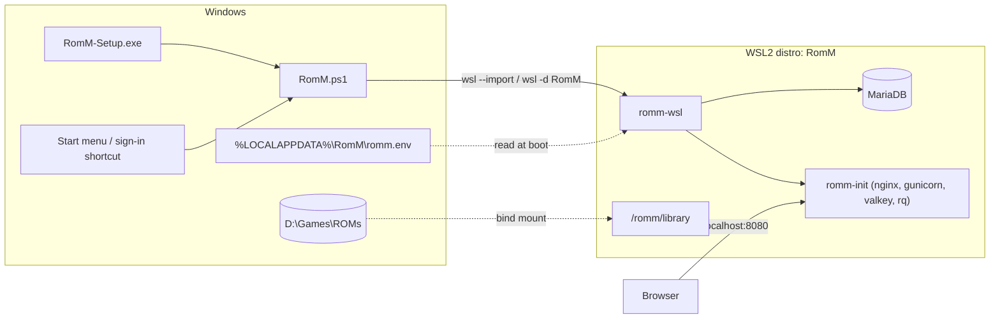

# RomM for Windows (WSL2)

A Windows installer that runs the stock RomM image as a WSL2 distro, so there's no Docker Desktop and no compose file to manage.

## How it works



- `Dockerfile` builds on `rommapp/romm` and adds MariaDB plus the `romm-wsl` launcher. `build-rootfs.sh` exports it as a tarball for `wsl --import` and writes the matching versioned script.
- `release-notes.sh` renders `release-notes.md.tmpl` into a release body.
- `rootfs/romm-wsl.sh` runs in the foreground inside the distro. It generates secrets on first boot, starts MariaDB on 127.0.0.1, bind-mounts the Windows library folder at `/romm/library`, and then runs the image's normal entrypoint with RomM's init script, copied to `/usr/local/bin/romm-init` because WSL mounts its own init binary over `/init`.
- `RomM.ps1` is the Windows-side manager, with the commands `install`, `start`, `stop`, `restart`, `open`, `status`, `logs`, `upgrade` and `uninstall`. `start` keeps a hidden `wsl.exe` attached to the launcher, because WSL shuts a distro down once nothing is attached to it.
- `romm.iss` is the Inno Setup installer. It checks for WSL, asks for the library folder and port, and adds Start menu entries and an optional sign-in shortcut. When an existing install is found, it runs `upgrade` instead of `install`.

All of RomM's state (database, covers, saves, states, config, secrets) lives in the distro's virtual disk at `%LOCALAPPDATA%\RomM\wsl`. `upgrade` and `uninstall -KeepData` tar that state to `%LOCALAPPDATA%\RomM\state-backup.tar`, and the next `install` restores it. The ROM library is only mounted, so RomM never copies or moves it.

## Releases

Every published RomM release gets `RomM-<version>.ps1` and `romm-wsl-<version>.tar.gz` attached, plus a "Windows (WSL2)" section in its notes with install and upgrade steps. `.github/workflows/windows-wsl.yml` does this: `build.yml` calls it once the release image is pushed, and it builds from that image's digest. To backfill an existing release, run the workflow by hand with the release tag.

The files carry the version because each script only works with the rootfs it was built with. `build-rootfs.sh` stamps the version into the script, which then defaults `-Rootfs` to the matching tarball in its own folder, and `status` shows both versions. The section in the notes sits between `romm-windows` markers, so a rerun replaces it rather than adding a second copy.

## Building

On any machine with Docker:

```bash
packaging/windows/build-rootfs.sh                             # rommapp/romm:5.3.1, version "dev"
packaging/windows/build-rootfs.sh rommapp/romm:5.4.0 5.4.0    # writes dist/RomM-5.4.0.ps1 and dist/romm-wsl-5.4.0.tar.gz
```

Then on Windows, with [Inno Setup 6](https://jrsoftware.org/isinfo.php), from `packaging\windows`:

```powershell
iscc /DAppVersion=5.4.0 romm.iss   # writes dist\RomM-Setup-5.4.0.exe
```

To try it without the installer:

```powershell
wsl --install --no-distribution   # once, as administrator, then reboot
.\dist\RomM-dev.ps1 install -Library 'D:\Games\ROMs'
.\dist\RomM-dev.ps1 open
```

## Settings

RomM listens on port 8080 by default, which other apps (qBittorrent's Web UI, for one) also use. Pick another with `.\RomM.ps1 install -Port 8090`, or change `ROMM_PORT` in `romm.env` and restart.

`RomM.ps1` runs under both Windows PowerShell 5.1 (`powershell`) and PowerShell 7 (`pwsh`).

`%LOCALAPPDATA%\RomM\romm.env` accepts any RomM [environment variable](https://docs.romm.app/latest/Getting-Started/Environment-Variables/) (metadata API keys, `SCAN_WORKERS`, and so on). Run `.\RomM.ps1 restart` after editing it. The launcher sets `DB_*` and the secrets itself.

## Known limitations

- **Requires WSL2**: Windows 10 2004+ or Windows 11, with virtualization enabled. The installer can't enable WSL by itself, because that needs admin rights and a reboot.
- **LAN access**: WSL2 only forwards `localhost`. To reach RomM from other devices, set `networkingMode=mirrored` in `%USERPROFILE%\.wslconfig` (Windows 11 22H2+), or add a `netsh interface portproxy` rule.
- **Scan speed**: WSL reads files on Windows drives (`/mnt/<drive>`) through 9P, so scanning and hashing are slower than on native Linux.
- **No rescan on change**: inotify doesn't fire for changes made from Windows, so `ENABLE_RESCAN_ON_FILESYSTEM_CHANGE` does nothing. Use scheduled rescans instead.
- **Per user**: a WSL distro belongs to one Windows user and runs only while that user is signed in. There's no headless service mode.
- **x64 only**: the build exports the `linux/amd64` image.
